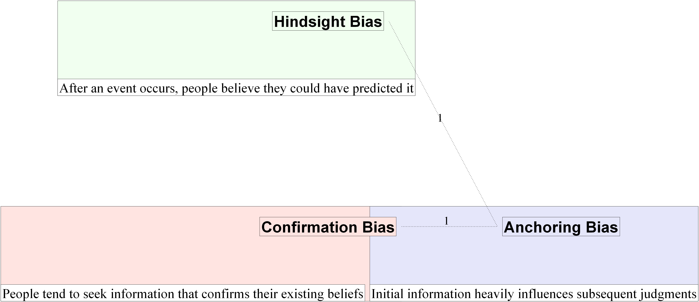

# Bias-oriented Notation

## Purpose

The bias-oriented notation is designed to analyze the relationships between cognitive biases and statements. It helps identify:
- Which statements are influenced by specific biases
- How biases are connected to each other
- The hierarchy of bias influence

## Key Features

1. **Bias Objects**
   - Each bias is represented as a separate object
   - Biases can have relationships with other biases
   - The `related_to` property shows connections between biases

2. **Statement Connections**
   - Statements are connected to biases they are influenced by
   - Multiple statements can be connected to a single bias
   - Statement connections show the impact of biases

3. **Visualization**
   - Biases are shown as nodes
   - Statements are connected to biases they are influenced by
   - Bias relationships are shown through connections
   - A dedicated "No Cognitive Biases" column is shown on the left for statements without bias connections

## Use Cases

- Analyzing the impact of cognitive biases
- Understanding bias relationships
- Identifying patterns in biased reasoning
- Tracking the spread of biases across statements

## Example

```json
{
  "statements": [
    {
      "id": "s1",
      "text": "The project will be completed on time",
      "biases": ["optimism_bias"]
    }
  ],
  "biases": [
    {
      "id": "optimism_bias",
      "name": "Optimism Bias",
      "related_to": ["planning_fallacy"]
    }
  ]
}
```

## Visual Elements

### Nodes
- **Cognitive Biases**: 
  - Displayed as colored nodes
  - Each bias is assigned a unique pastel color
  - Node size indicates the number of connected statements
- **No Cognitive Biases**:
  - Displayed as a gray column on the left
  - Contains statements without bias connections
- **Statements**:
  - Displayed as white rectangles
  - Connected to biases they are influenced by
  - If a statement is connected to multiple biases:
    - Connected to all relevant bias nodes
    - Lines show the influence relationship

### Connections
- Solid lines between biases show relationships
- Dotted lines connect statements to biases
- Line thickness indicates the strength of the relationship
- Arrows show the direction of influence

## Usage
```sh
python tools/render_graph.py <input_file> bias
```

## Example
 